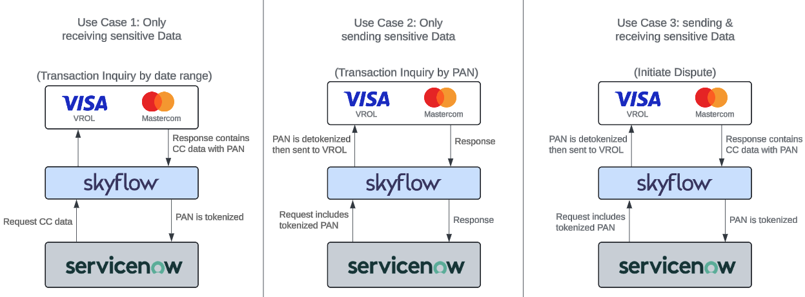

# ServiceNow
ServiceNow has collaborated with Skyflow to offload PCI compliance and offer its customers the capability to leverage the ServiceNow platform for financial services mainly in the dispute management space connecting to services like Mastercard/Mastercom and Visa/VROL. The image below shows a sample of what can be accomplished:


# Mastercom
This repository contains the full postman collection necessary to allow Skyflow to send/receive sensitive data from the Mastercard dispute management service - Mastercom.

Note: these examples are not an officially-supported product or recommended for production deployment without further review, testing, and hardening. Use with caution, this is sample code only.

## Prerequisites

- Create or log into your Skyflow account
- Create a vault and relevant schema to hold your data
- Create a service account and download the credentials.json file
- Copy your Vault URL, Vault ID and Account ID and store within your postman environment variables.
- Finally, execute the attached postman collection "Mastercom Package" by running all requests in its default order.

## Script Overview
Mastercom requires that a specific signature be passed in every request to authenticate the user. This signature is calculated based on multiple variables listed below:
```bash
const consumerKey = "<insert consumer key>";
const uri = "https://sandbox.api.mastercard.com/service";
const method = "POST";
const payload = "Hello world!";
```
Once these variables are collected, the below SDK method should be triggered:
```bash
const oauth = require('mastercard-oauth1-signer');
const authHeader = oauth.getAuthorizationHeader(uri, method, payload, consumerKey, signingKey);
```
Below you can find a complete end to end script to execute such process. Such script is already embedded in the attached postman collection.

### nodeJS script

```node
const axios = require('axios');
const oauth = require('mastercard-oauth1-signer');

const { signingKey, consumerKey, vaultID, vaultURL } = process.env;

// Don't change the function name. It needs to be skyflowmain.
exports.skyflowmain = async (event) => {
    try {
        // Validate event structure
        if (!event || !event.BodyContent || !event.Headers || !event.QueryParam) {
            throw new Error("Invalid event object received.");
        }

        // Decode and parse request payload safely
        let payload;
        try {
            const request = Buffer.from(event.BodyContent, "base64");
            payload = JSON.parse(request.toString());
        } catch (error) {
            throw new Error("Failed to decode or parse the request payload: " + error.message);
        }

        // Extract headers safely
        const headers = event.Headers;
        if (!headers['X-Skyflow-Authorization'] || !headers['X-Skyflow-Authorization'][0]) {
            throw new Error("Missing or invalid X-Skyflow-Authorization header.");
        }
        const accessToken = headers['X-Skyflow-Authorization'][0];

        if (!headers['X-Request-Audit-Uri-Method'] || !headers['X-Request-Audit-Uri-Method'][0]) {
            throw new Error("Missing or invalid X-Request-Audit-Uri-Method header.");
        }
        const method = headers['X-Request-Audit-Uri-Method'][0];

        if (!event.QueryParam.URI) {
            throw new Error("Missing URI parameter.");
        }
        const uri = event.QueryParam.URI;

        // Detokenization if needed
        if (payload.primaryAccountNum) {
            try {
                let response = await detokenize(accessToken, payload.primaryAccountNum);
                if (response && response.data && response.data.records && response.data.records.length > 0) {
                    payload.primaryAccountNum = response.data.records[0].value;
                } else {
                    throw new Error("Detokenization response missing expected data.");
                }
            } catch (error) {
                console.error("Detokenization failed: " + error.message);
                return { error: "Detokenization failed", details: error.message };
            }
        }

        let data = JSON.stringify(payload);

        // Generate OAuth header
        let authHeader;
        try {
            authHeader = oauth.getAuthorizationHeader(uri, method, data, consumerKey, signingKey);
        } catch (error) {
            throw new Error("Failed to generate OAuth header: " + error.message);
        }

        // Call Mastercom
        try {
            const response = await callMastercom(uri, method, data, authHeader);
            return response;
        } catch (error) {
            console.error("Error in callMastercom: " + error.message);
            return { error: "Mastercom API call failed", details: error.message };
        }

    } catch (error) {
        console.error("Error in skyflowmain:", error.message);
        return { error: "Function execution failed", details: error.message };
    }
};

async function callMastercom(uri, method, data, authHeader) {
    let config = {
        method: method,
        maxBodyLength: Infinity,
        url: uri,
        headers: {
            'Authorization': authHeader,
            'Content-Type': 'application/json',
        },
        data: data
    };

    console.log("About to Call Axios");

    try {
        const response = await axios.request(config);
        return response.data;
    } catch (error) {
        console.error("Axios request failed:", error.message);
        return { error: "Axios request failed", details: error.message };
    }
}

async function detokenize(accessToken, tokenized_pan) {
    const url = `${vaultURL}/v1/vaults/${vaultID}/detokenize`;
    const headers = {
        'Authorization': 'Bearer ' + accessToken,
        'Content-Type': 'application/json'
    };
    const body = {
        "detokenizationParameters": [
            {
                "token": tokenized_pan,
                "redaction": "PLAIN_TEXT"
            }
        ]
    };

    try {
        const resp = await axios.post(url, body, { headers });
        return resp;
    } catch (error) {
        console.error("Detokenization request failed:", error.message);
        return { error: "Detokenization request failed", details: error.message };
    }
}
```

#### Use this script
This script is now stored as a secure function in Skyflow. Before using it, ensure that you have defined the vaultID, vaultURL and created the necessary environment variables (signingKey & consumerKey) provided in your Mastercom account.

Now, secure functions can be triggered through the created inbound connection. Once this connection is invoked, the function will automatically be triggered firing an API request to Mastercom as defined in the callMastercom function.

# VROL
This repository contains the full postman collection necessary to allow Skyflow to send/receive sensitive data from the VISA dispute management service - VROL.

Note: these examples are not an officially-supported product or recommended for production deployment without further review, testing, and hardening. Use with caution, this is sample code only.

## Prerequisites

- Create or log into your Skyflow account
- Create a vault and relevant schema to hold your data
- Create a service account and download the credentials.json file
- Copy your Vault URL, Vault ID and Account ID and store within your postman environment variables.
- Ensure you have created the required mTLS certs to allow Skyflow to authenticate the VROL services.
- Finally, execute the attached postman collection "VROL Package" by running all requests in its default order.

#### Use this collection
This collection creates an outbound connection which when invoked passes the API payload to VROL and receives back the raw response. Before using it, ensure that you have defined the vaultID, vaultURL and created the necessary mTLS certs provided in your VROL account and updated your postman collection accordingly.
